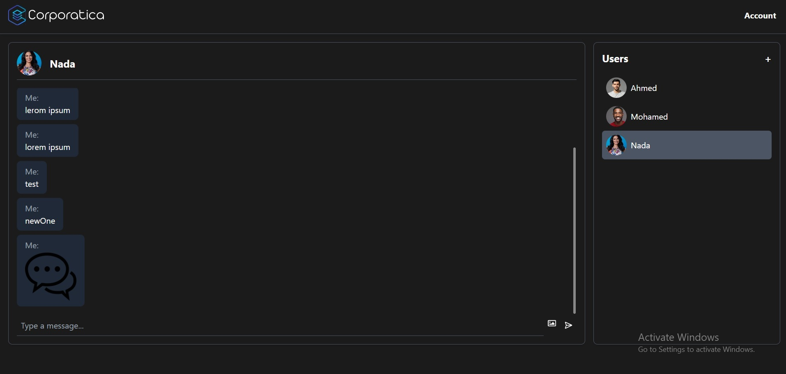
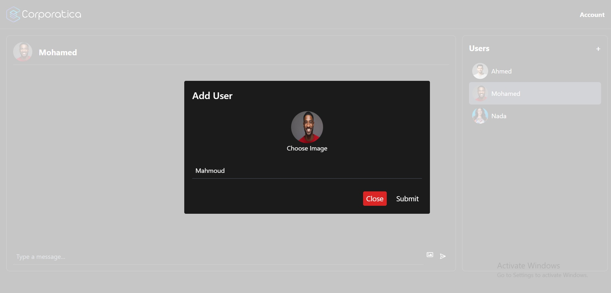
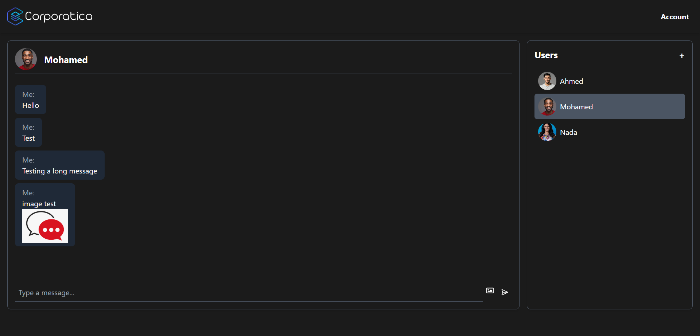
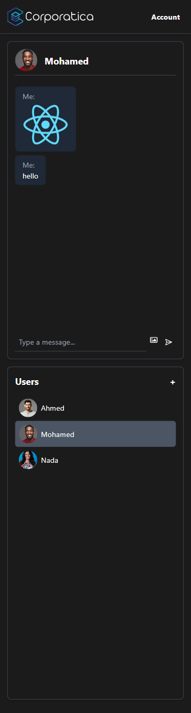

# Chat Application

Welcome to the Chat Application! This application allows users to communicate through text and image messages in a user-friendly interface. It is designed to provide a seamless chat experience with features that enhance user interaction and engagement.

  


## Features

### User Management
- **Add Users**: Easily add new users to the chat application. Each user can have a unique name and profile image.
  
- **User List**: View a list of all users currently available in the chat application.  

### Messaging
- **Text Messages**: Send text messages in real-time. The chat interface is designed to display messages clearly and concisely.
- **Image Messages**: Share images with other users. The application supports image uploads, allowing users to send pictures along with text messages.
- **Message Preview**: Preview images before sending them to ensure the correct file is selected.

### Chat Interface
- **User-Specific Conversations**: View chat history for each user. The application allows you to select a user and view the conversation specific to that user.
- **Scrollable Chat**: The chat interface is scrollable, allowing users to navigate through past messages easily.
- **Customizable Scrollbar**: The scrollbar is styled for a modern look and feel, enhancing the overall user experience.
  

### Real-Time Updates
- **Automatic Scrolling**: The chat window automatically scrolls to the latest message, ensuring users are always viewing the most recent conversation.
- **Responsive Design**: The application is designed to be responsive, providing a consistent experience across different devices and screen sizes.
  <br />
  

## Getting Started

### Prerequisites
- Node.js and npm installed on your machine.

### Installation
1. Clone the repository:
   ```bash
   [git clone https://github.com/yourusername/chat-application.git](https://github.com/omarmreda/chat-app.git)
   ```
2. Navigate to the project directory:
   ```bash
   cd chat-application
   ```
3. Install the dependencies:
   ```bash
   npm install
   ```

### Running the Application
Start the development server:

Open your browser and navigate to `http://localhost:3000` to view the application.

## Usage

- **Adding Users**: Click on the "Add User" button, enter the user's name, and select a profile image to add a new user.
- **Sending Messages**: Select a user from the user list to start a conversation. Type your message in the input field and click "Send" to send a text message. Use the image icon to upload and send an image.
- **Viewing Conversations**: Click on a user to view the chat history. The conversation will display all messages exchanged with that user.

## Technologies Used

- **React**: A JavaScript library for building user interfaces.
- **Framer Motion**: For animations and transitions.
- **React Router**: For handling navigation within the application.
- **Tailwind CSS**: For styling the application with utility-first CSS.
